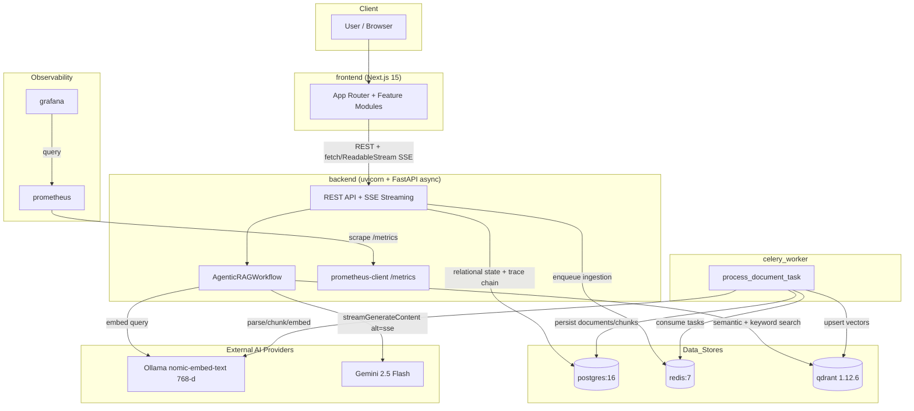
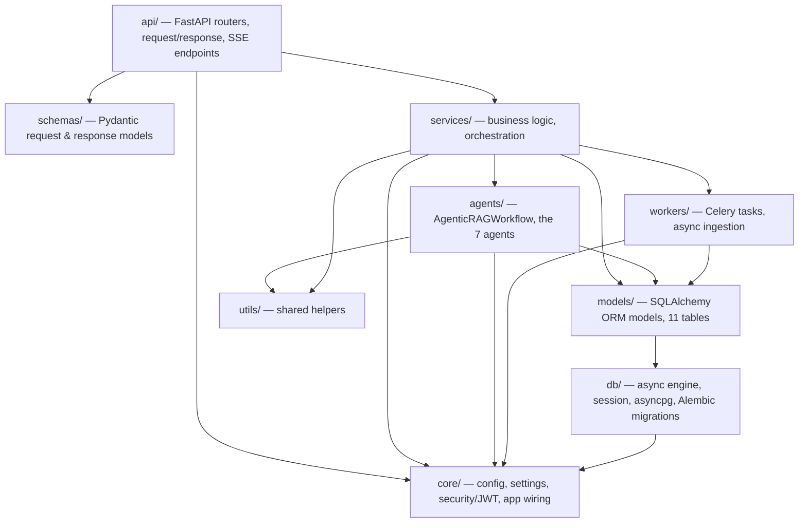
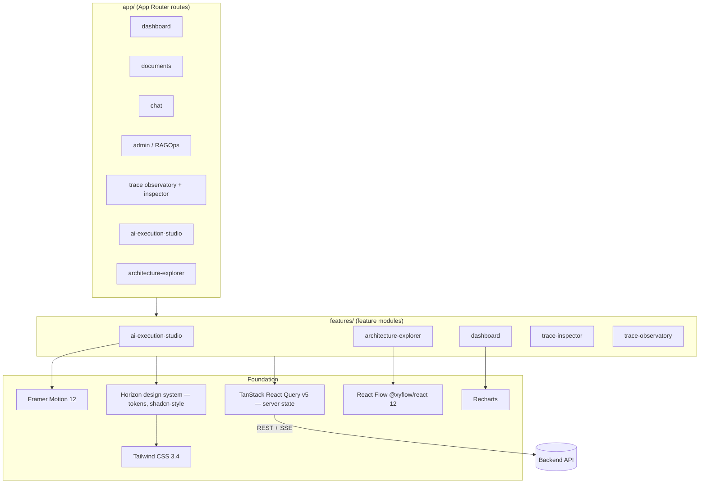
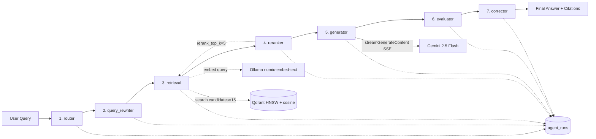
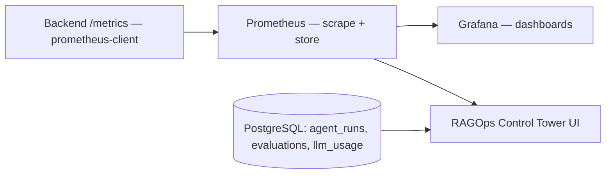
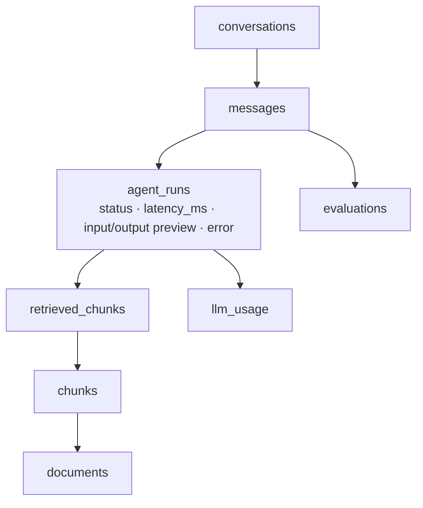
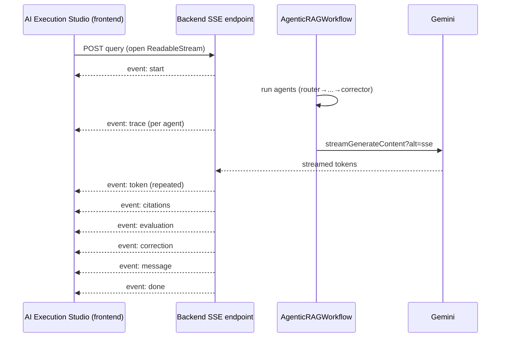

# 02 — System Architecture

## 1. Overview

DevPilot AI is a containerized, service-oriented system composed of **eight Docker services** orchestrated with Docker Compose. The platform separates concerns cleanly across an async FastAPI backend, a Next.js 15 frontend, persistent stores (PostgreSQL, Redis, Qdrant), asynchronous workers (Celery), and an observability tier (Prometheus + Grafana). The intelligence layer is implemented as an **agentic RAG workflow** of seven cooperating agents, with every step persisted for full traceability.

This document describes the high-level architecture, the backend's layered design, the frontend's feature-module design, the RAG pipeline, the RAGOps observability architecture, the traceability chain, and the AI Execution Studio.

---

## 2. Global Architecture — The Eight Docker Services & Data Flow

The system is deployed as eight cooperating containers. The backend serves the API and streams answers; the Celery worker handles asynchronous document ingestion; PostgreSQL holds relational state and the full trace chain; Redis is the broker/result backend; Qdrant holds vector embeddings; Prometheus scrapes metrics and Grafana visualizes them; the frontend serves the UI.

**Data flow narrative:**

1. The user interacts with the Next.js frontend, which calls the backend over REST and consumes streamed answers via `fetch` + `ReadableStream` over Server-Sent Events.
2. On document upload, the backend persists document metadata to PostgreSQL and enqueues a `process_document_task` on Redis. The Celery worker consumes it, parses and chunks the document, computes embeddings via Ollama, and upserts the resulting vectors into Qdrant while persisting chunks to PostgreSQL.
3. On a chat query, the backend's `AgenticRAGWorkflow` embeds the query (Ollama), retrieves candidate chunks from Qdrant, reranks them, and streams a grounded answer from Gemini. Every agent step is persisted to PostgreSQL.
4. Prometheus scrapes the backend's `/metrics` endpoint; Grafana visualizes those metrics.

---

## 3. Backend Architecture — Layered Design

The backend is a single FastAPI application organized into clean, separated layers. Each layer has a single responsibility, and dependencies flow downward (API depends on services, services depend on db/models/agents, etc.).

### 3.1 Layer responsibilities

| Layer | Responsibility |
|---|---|
| `api/` | FastAPI routers and endpoints; HTTP request/response handling; the SSE streaming endpoints (`StreamingResponse`, `text/event-stream`). |
| `core/` | Application configuration and settings; security (JWT issuance/verification, the `user`/`admin`/`super_admin` roles); app wiring and startup. |
| `db/` | Database access foundation: the async SQLAlchemy engine over `asyncpg`, session management, and Alembic migrations. |
| `models/` | SQLAlchemy ORM definitions for the 11 tables. |
| `schemas/` | Pydantic models defining the shape of API requests and responses, with validation. |
| `services/` | Business logic and orchestration — the layer that coordinates agents, persistence, and workers. |
| `agents/` | The `AgenticRAGWorkflow` class and its seven agents. |
| `workers/` | Celery tasks, principally `process_document_task` (async document ingestion) with `max_retries=3`. |
| `utils/` | Cross-cutting shared helpers. |

### 3.2 Technology choices in the backend

The backend is fully **async**: FastAPI with async route handlers, SQLAlchemy in async mode over `asyncpg`, and async I/O to Qdrant, Ollama, and Gemini. Alembic manages schema migrations. Pydantic enforces input/output contracts. `prometheus-client` exposes the metrics endpoint scraped by Prometheus.

---

## 4. Frontend Architecture

The frontend is a **Next.js 15** application using the **App Router**, written in **strict TypeScript** (zero `any`). It is organized around **feature modules** and a custom design system.

### 4.1 Structure

- **App Router (`app/`)** — route segments map to the platform's surfaces (dashboard, documents, chat, admin/RAGOps, trace observatory/inspector, AI Execution Studio, Architecture Explorer).
- **Feature modules (`features/`)** — each major capability is a self-contained module (e.g., `ai-execution-studio`, `architecture-explorer`, `dashboard`, `trace-inspector`, `trace-observatory`) holding its components, helpers, and tests co-located.
- **Design system — "Horizon"** — a custom token-based design system in the shadcn style, providing consistent UI primitives (e.g., a `StatusBadge`) on top of Tailwind CSS 3.4.
- **Server state — TanStack React Query v5** — manages data fetching, caching, and synchronization with the backend REST API.
- **Visualization libraries** — Recharts for charts/metrics, Framer Motion 12 for animation (used heavily in the AI Execution Studio), and React Flow (`@xyflow/react` 12) for the Architecture Explorer graph.
- **Testing** — Vitest + Testing Library, with co-located test files (e.g., `helpers.test.ts`, `StatusBadge.test.tsx`).

### 4.2 Streaming on the client

For chat answers, the frontend does not poll. It opens a streaming connection to the backend's SSE endpoint and consumes it with `fetch` + `ReadableStream`, parsing the structured event types (`start`, `trace`, `token`, `citations`, `evaluation`, `correction`, `message`, `done`, `error`) and updating the UI — including the AI Execution Studio animation — in real time.

---

## 5. RAG Pipeline Architecture — The Seven-Agent Flow

The intelligence of DevPilot AI is the `AgenticRAGWorkflow` class, a pipeline of **seven cooperating agents**. Each agent is persisted to the `agent_runs` table with its status, latency, input/output preview, and any error, which is what makes the entire pipeline traceable.

### 5.1 The agents

| # | Agent | Role |
|---|---|---|
| 1 | `router` | Routes/classifies the incoming query to decide how it should be handled. |
| 2 | `query_rewriter` | Rewrites/refines the user query to improve retrieval quality. |
| 3 | `retrieval` | Embeds the query (Ollama) and retrieves candidate chunks from Qdrant. |
| 4 | `reranker` | Reranks the retrieved candidates down to the most relevant set. |
| 5 | `generator` | Generates the grounded answer from the reranked context using Gemini, streamed token-by-token. |
| 6 | `evaluator` | Automatically evaluates the generated answer, producing a score persisted to `evaluations`. |
| 7 | `corrector` | Applies correction to the answer where the evaluation indicates it is needed. |

### 5.2 Retrieval configuration (real)

- Embeddings: **Ollama `nomic-embed-text`, 768-dimensional, batch size 4**.
- Vector store: **Qdrant 1.12.6**, HNSW index with **cosine** distance.
- Retrieval: **`top_k=5`** final results from **`candidates=15`**.
- Reranking: **enabled**, **`rerank_top_k=5`**.
- Context assembly: max context **6000 characters**.
- Retrieval mode: **hybrid** (semantic + keyword).

### 5.3 Generation configuration (real)

- Model: **Gemini 2.5 Flash**, fallback **Gemini 2.0 Flash**.
- Decoding: **temperature 0.2**, **max 1000 output tokens**.
- Streaming: real token streaming via Gemini `streamGenerateContent?alt=sse`.

---

## 6. RAGOps (Observability) Architecture

RAGOps treats the RAG pipeline as a production system with first-class observability. The backend exposes a Prometheus metrics endpoint via `prometheus-client`; Prometheus scrapes it; Grafana visualizes it. On top of this metrics backbone, the **RAGOps Control Tower** in the frontend provides the operational product surface — health, throughput, latency, token usage, and error signals — for the people who operate the platform.

The relational stores feed RAGOps too: `agent_runs` provides per-step latency and error data, `evaluations` provides answer-quality signals, and `llm_usage` provides token/usage accounting.

---

## 7. Traceability Architecture — The Chain

Traceability is the architectural property that makes DevPilot AI auditable. Every answer is decomposable into a chain of persisted records, rooted at the `message` and extending through the agent runs, the chunks they retrieved, and the evaluation of the final answer.

### 7.1 The chain explained

- A **message** belongs to a **conversation** in a workspace.
- Each message produces one or more **agent_runs** (one per agent in the seven-agent workflow), each recording status, `latency_ms`, an input/output preview, and any error.
- The retrieval/reranker agents link to **retrieved_chunks**, which reference the underlying **chunks**, which belong to **documents**.
- The message links to its **evaluations** (the automatic quality score).
- LLM calls accrue **llm_usage** records for token/usage accounting.

This chain is exactly what the **AI Trace Inspector** (nine-section detail view) and the **RAG Trace Observatory** (list view) render, and it is the concrete realization of the platform's "complete transparency" promise.

### 7.2 The eleven tables

`users`, `workspaces`, `workspace_members`, `documents`, `chunks`, `conversations`, `messages`, `agent_runs`, `retrieved_chunks`, `evaluations`, `llm_usage`.

---

## 8. AI Execution Studio Architecture

The AI Execution Studio is a frontend visualization layer that binds **the real SSE event stream** to a **ten-stage animated pipeline** with an animated AI avatar. It does not simulate execution — it reacts to it.

As each event arrives, the Studio advances its animated pipeline stage, updates the AI avatar's state, renders streamed tokens, and surfaces citations, evaluation, and correction — giving the viewer a live, faithful visualization of the backend's actual reasoning.

---

## 9. Summary

DevPilot AI's architecture is an eight-service containerized system with a cleanly layered async FastAPI backend, a feature-module Next.js 15 frontend, three specialized data stores (PostgreSQL, Redis, Qdrant), a Celery worker for async ingestion, a Prometheus/Grafana observability tier, and a seven-agent RAG workflow whose every step is persisted into an auditable trace chain. This architecture is what enables the platform's defining properties: grounded answers, real-time streaming, automatic evaluation, and complete transparency.
