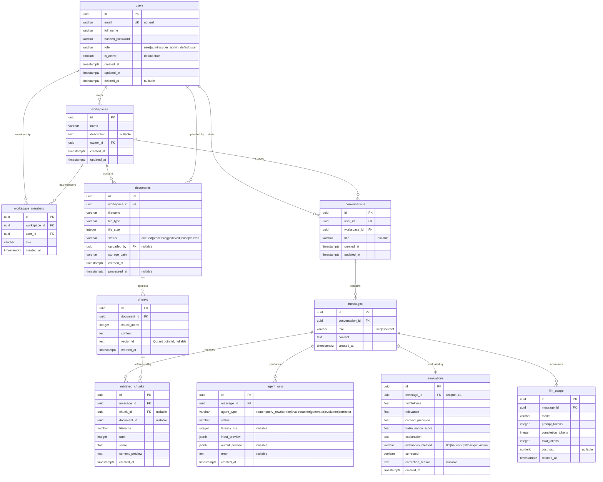

# 04 — Database Design

This chapter documents the relational data model of the DevPilot AI platform. The
database is PostgreSQL, all primary keys are UUIDs, and the schema is managed
through Alembic migrations. The model captures identity and access control,
workspace organisation, document ingestion, the agentic RAG conversation flow,
and the observability records produced by the multi-agent pipeline.

## 1. Entity-Relationship Diagram



## 2. SQL DDL (PostgreSQL)

The following DDL reflects the canonical schema. All tables use `uuid` primary
keys (default `gen_random_uuid()`), and timestamps are `timestamptz`.

```sql
-- Required for gen_random_uuid()
CREATE EXTENSION IF NOT EXISTS pgcrypto;

-- =========================================================
-- users
-- =========================================================
CREATE TABLE users (
    id              UUID PRIMARY KEY DEFAULT gen_random_uuid(),
    email           VARCHAR(255) NOT NULL UNIQUE,
    full_name       VARCHAR(255),
    hashed_password VARCHAR(255),
    role            VARCHAR(20) NOT NULL DEFAULT 'user'
                    CHECK (role IN ('user', 'admin', 'super_admin')),
    is_active       BOOLEAN NOT NULL DEFAULT TRUE,
    created_at      TIMESTAMPTZ NOT NULL DEFAULT now(),
    updated_at      TIMESTAMPTZ NOT NULL DEFAULT now(),
    deleted_at      TIMESTAMPTZ
);

-- =========================================================
-- workspaces
-- =========================================================
CREATE TABLE workspaces (
    id          UUID PRIMARY KEY DEFAULT gen_random_uuid(),
    name        VARCHAR(255) NOT NULL,
    description TEXT,
    owner_id    UUID NOT NULL REFERENCES users(id) ON DELETE CASCADE,
    created_at  TIMESTAMPTZ NOT NULL DEFAULT now(),
    updated_at  TIMESTAMPTZ NOT NULL DEFAULT now()
);

CREATE INDEX idx_workspaces_owner_id ON workspaces(owner_id);

-- =========================================================
-- workspace_members
-- =========================================================
CREATE TABLE workspace_members (
    id           UUID PRIMARY KEY DEFAULT gen_random_uuid(),
    workspace_id UUID NOT NULL REFERENCES workspaces(id) ON DELETE CASCADE,
    user_id      UUID NOT NULL REFERENCES users(id) ON DELETE CASCADE,
    role         VARCHAR(20) NOT NULL,
    created_at   TIMESTAMPTZ NOT NULL DEFAULT now(),
    CONSTRAINT uq_workspace_member UNIQUE (workspace_id, user_id)
);

CREATE INDEX idx_workspace_members_workspace_id ON workspace_members(workspace_id);
CREATE INDEX idx_workspace_members_user_id ON workspace_members(user_id);

-- =========================================================
-- documents
-- =========================================================
CREATE TABLE documents (
    id           UUID PRIMARY KEY DEFAULT gen_random_uuid(),
    workspace_id UUID NOT NULL REFERENCES workspaces(id) ON DELETE CASCADE,
    filename     VARCHAR(512) NOT NULL,
    file_type    VARCHAR(100),
    file_size    INTEGER,
    status       VARCHAR(20) NOT NULL DEFAULT 'queued'
                 CHECK (status IN ('queued', 'processing', 'indexed', 'failed', 'deleted')),
    uploaded_by  UUID REFERENCES users(id) ON DELETE SET NULL,
    storage_path VARCHAR(1024),
    created_at   TIMESTAMPTZ NOT NULL DEFAULT now(),
    processed_at TIMESTAMPTZ
);

CREATE INDEX idx_documents_workspace_id ON documents(workspace_id);
CREATE INDEX idx_documents_status ON documents(status);

-- =========================================================
-- chunks
-- =========================================================
CREATE TABLE chunks (
    id          UUID PRIMARY KEY DEFAULT gen_random_uuid(),
    document_id UUID NOT NULL REFERENCES documents(id) ON DELETE CASCADE,
    chunk_index INTEGER NOT NULL,
    content     TEXT NOT NULL,
    vector_id   TEXT,  -- Qdrant point id, nullable until indexed
    created_at  TIMESTAMPTZ NOT NULL DEFAULT now()
);

CREATE INDEX idx_chunks_document_id ON chunks(document_id);

-- =========================================================
-- conversations
-- =========================================================
CREATE TABLE conversations (
    id           UUID PRIMARY KEY DEFAULT gen_random_uuid(),
    user_id      UUID NOT NULL REFERENCES users(id) ON DELETE CASCADE,
    workspace_id UUID NOT NULL REFERENCES workspaces(id) ON DELETE CASCADE,
    title        VARCHAR(512),
    created_at   TIMESTAMPTZ NOT NULL DEFAULT now(),
    updated_at   TIMESTAMPTZ NOT NULL DEFAULT now()
);

CREATE INDEX idx_conversations_user_id ON conversations(user_id);
CREATE INDEX idx_conversations_workspace_id ON conversations(workspace_id);

-- =========================================================
-- messages
-- =========================================================
CREATE TABLE messages (
    id              UUID PRIMARY KEY DEFAULT gen_random_uuid(),
    conversation_id UUID NOT NULL REFERENCES conversations(id) ON DELETE CASCADE,
    role            VARCHAR(20) NOT NULL CHECK (role IN ('user', 'assistant')),
    content         TEXT NOT NULL,
    created_at      TIMESTAMPTZ NOT NULL DEFAULT now()
);

CREATE INDEX idx_messages_conversation_id ON messages(conversation_id);

-- =========================================================
-- agent_runs
-- =========================================================
CREATE TABLE agent_runs (
    id             UUID PRIMARY KEY DEFAULT gen_random_uuid(),
    message_id     UUID NOT NULL REFERENCES messages(id) ON DELETE CASCADE,
    agent_type     VARCHAR(30) NOT NULL
                   CHECK (agent_type IN ('router', 'query_rewriter', 'retrieval',
                                         'reranker', 'generator', 'evaluator', 'corrector')),
    status         VARCHAR(20) NOT NULL,
    latency_ms     INTEGER,
    input_preview  JSONB NOT NULL,
    output_preview JSONB,
    error          TEXT,
    created_at     TIMESTAMPTZ NOT NULL DEFAULT now()
);

CREATE INDEX idx_agent_runs_message_id ON agent_runs(message_id);
CREATE INDEX idx_agent_runs_agent_type ON agent_runs(agent_type);

-- =========================================================
-- retrieved_chunks
-- =========================================================
CREATE TABLE retrieved_chunks (
    id              UUID PRIMARY KEY DEFAULT gen_random_uuid(),
    message_id      UUID NOT NULL REFERENCES messages(id) ON DELETE CASCADE,
    chunk_id        UUID REFERENCES chunks(id) ON DELETE SET NULL,
    document_id     UUID,
    filename        VARCHAR(512),
    rank            INTEGER NOT NULL,
    score           FLOAT NOT NULL,
    content_preview TEXT,
    created_at      TIMESTAMPTZ NOT NULL DEFAULT now()
);

CREATE INDEX idx_retrieved_chunks_message_id ON retrieved_chunks(message_id);

-- =========================================================
-- evaluations (1:1 with messages)
-- =========================================================
CREATE TABLE evaluations (
    id                  UUID PRIMARY KEY DEFAULT gen_random_uuid(),
    message_id          UUID NOT NULL UNIQUE REFERENCES messages(id) ON DELETE CASCADE,
    faithfulness        FLOAT NOT NULL,
    relevance           FLOAT NOT NULL,
    context_precision   FLOAT NOT NULL,
    hallucination_score FLOAT NOT NULL,
    explanation         TEXT,
    evaluation_method   VARCHAR(20) NOT NULL DEFAULT 'unknown'
                        CHECK (evaluation_method IN ('llm', 'heuristic', 'fallback', 'unknown')),
    corrected           BOOLEAN NOT NULL DEFAULT FALSE,
    correction_reason   TEXT,
    created_at          TIMESTAMPTZ NOT NULL DEFAULT now()
);

-- =========================================================
-- llm_usage
-- =========================================================
CREATE TABLE llm_usage (
    id                UUID PRIMARY KEY DEFAULT gen_random_uuid(),
    message_id        UUID NOT NULL REFERENCES messages(id) ON DELETE CASCADE,
    model             VARCHAR(100) NOT NULL,
    prompt_tokens     INTEGER NOT NULL,
    completion_tokens INTEGER NOT NULL,
    total_tokens      INTEGER NOT NULL,
    cost_usd          NUMERIC(12, 6),
    created_at        TIMESTAMPTZ NOT NULL DEFAULT now()
);

CREATE INDEX idx_llm_usage_message_id ON llm_usage(message_id);
```

## 3. Constraints Summary

| Table | Constraint | Type | Description |
|-------|-----------|------|-------------|
| users | `email` | UNIQUE, NOT NULL | One account per email address |
| users | `role` | CHECK | `user` \| `admin` \| `super_admin` (default `user`) |
| users | `is_active` | DEFAULT TRUE | Soft activation flag |
| users | `deleted_at` | NULLABLE | Soft-delete marker |
| workspaces | `owner_id` | FK → users | Owning user; cascade on delete |
| workspace_members | `(workspace_id, user_id)` | UNIQUE | A user joins a workspace once |
| workspace_members | `workspace_id`, `user_id` | FK | Composite membership association |
| documents | `workspace_id` | FK → workspaces | Document belongs to one workspace |
| documents | `uploaded_by` | FK → users, NULLABLE | Set to NULL if uploader removed |
| documents | `status` | CHECK | `queued` \| `processing` \| `indexed` \| `failed` \| `deleted` |
| chunks | `document_id` | FK → documents | Chunk belongs to one document |
| chunks | `vector_id` | NULLABLE | Qdrant point id, set after indexing |
| conversations | `user_id`, `workspace_id` | FK | Scoped to a user and a workspace |
| messages | `conversation_id` | FK → conversations | Message belongs to a conversation |
| messages | `role` | CHECK | `user` \| `assistant` |
| agent_runs | `message_id` | FK → messages | Run attached to a message |
| agent_runs | `agent_type` | CHECK | One of the 7 agent types |
| retrieved_chunks | `message_id` | FK → messages | Retrieval record for a message |
| retrieved_chunks | `chunk_id` | FK → chunks, NULLABLE | Set to NULL if chunk removed |
| evaluations | `message_id` | FK → messages, UNIQUE | Enforces strict 1:1 with message |
| evaluations | `evaluation_method` | CHECK | `llm` \| `heuristic` \| `fallback` \| `unknown` |
| llm_usage | `message_id` | FK → messages | Token/cost record for a message |

## 4. Cardinalities

| Relationship | Cardinality | Notes |
|--------------|-------------|-------|
| users → workspaces | 1 — * | A user owns many workspaces (`owner_id`) |
| users ↔ workspaces | * — * | Via `workspace_members` association table |
| workspaces → documents | 1 — * | A workspace contains many documents |
| documents → chunks | 1 — * | A document is split into many chunks |
| users → conversations | 1 — * | A user starts many conversations |
| workspaces → conversations | 1 — * | A workspace scopes many conversations |
| conversations → messages | 1 — * | A conversation holds many messages |
| messages → agent_runs | 1 — * | A message produces many agent runs |
| messages → retrieved_chunks | 1 — * | A message retrieves many chunks |
| messages → evaluations | 1 — 1 | Exactly one evaluation per message |
| messages → llm_usage | 1 — * | A message may incur several LLM calls |

## 5. Migrations

The schema is versioned and applied through **Alembic**. Each schema change is
captured as a revision script, providing forward (`upgrade`) and backward
(`downgrade`) migration paths and an auditable history of the data model's
evolution.
