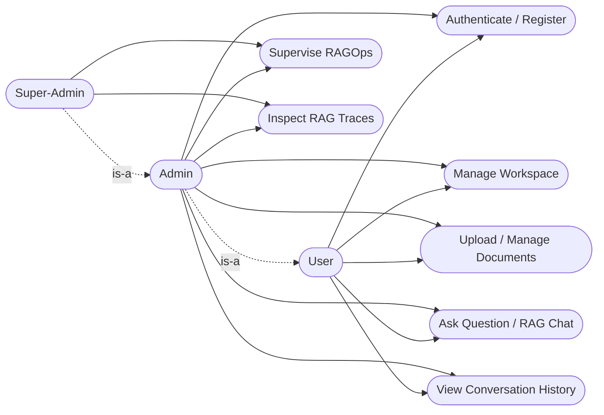
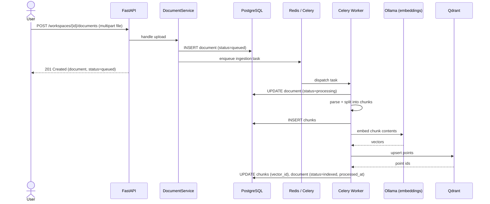
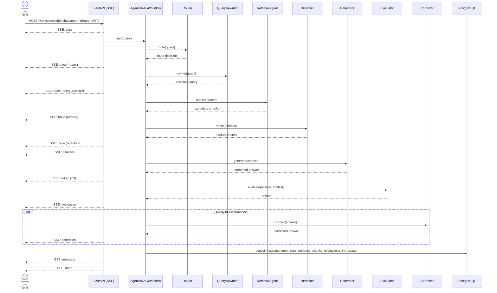
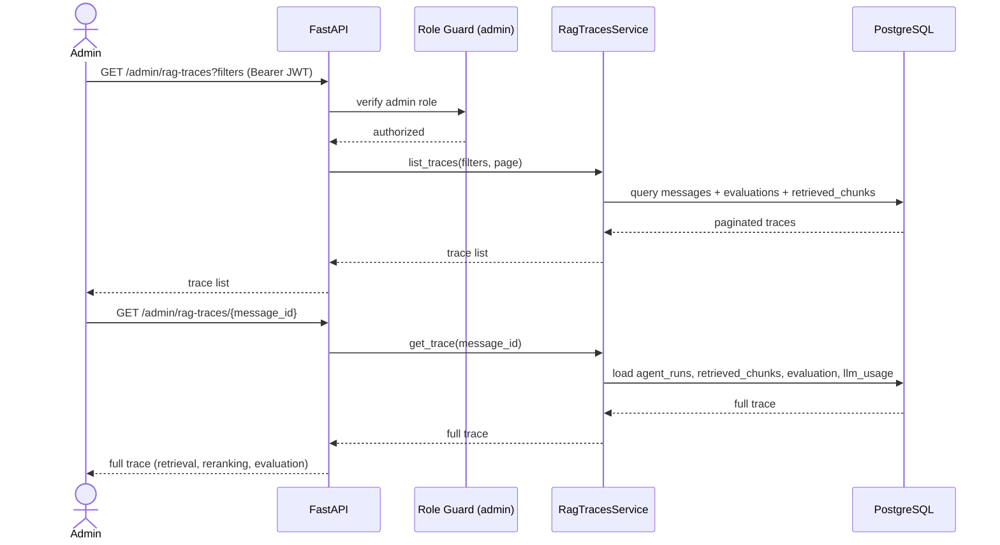
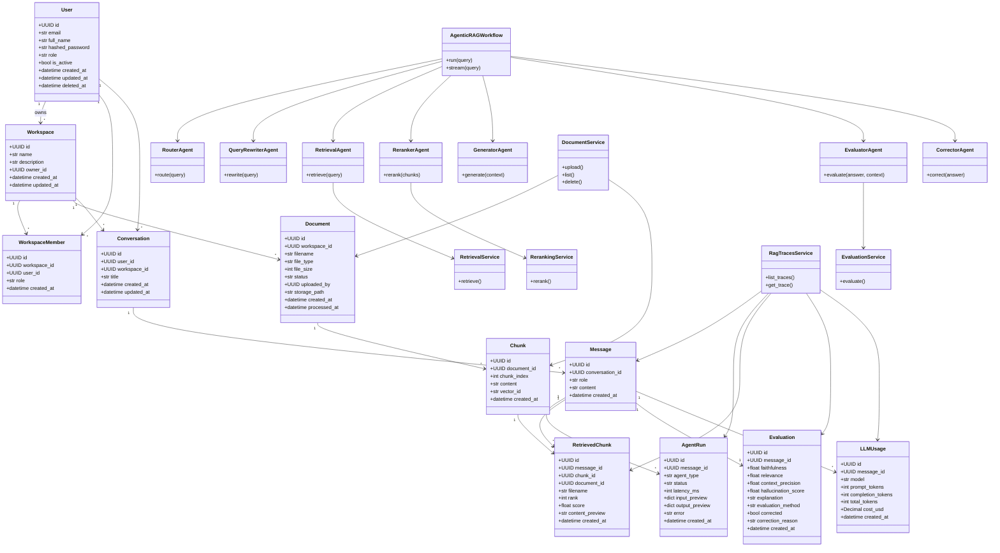
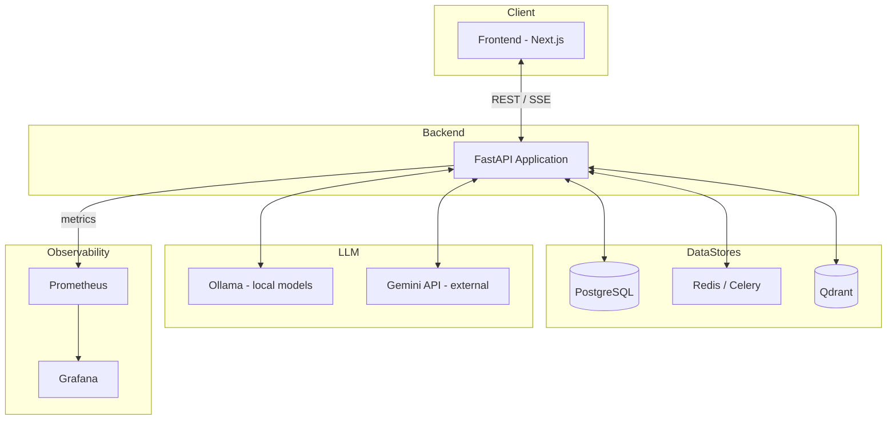
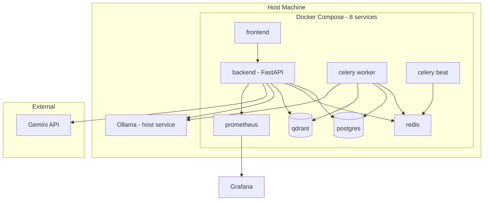
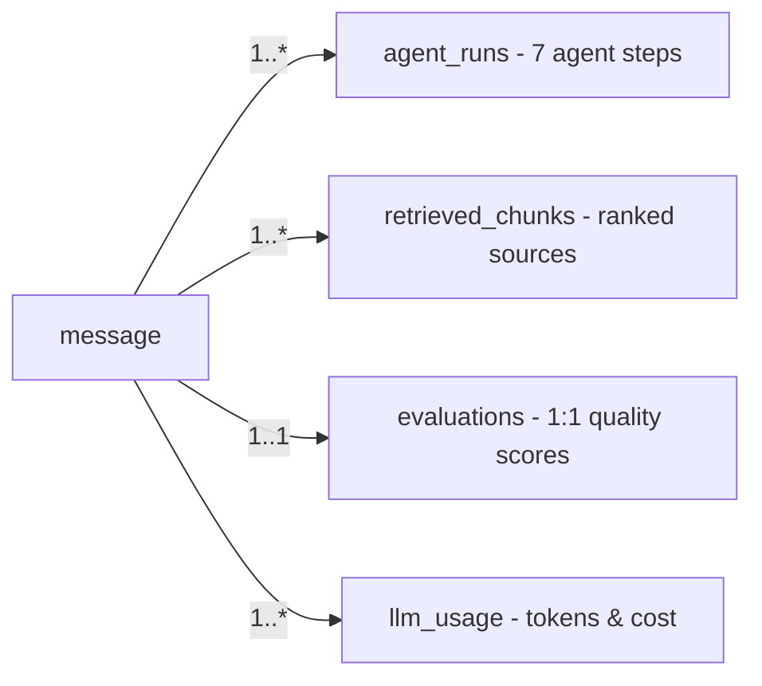

# 06 — UML Package

This chapter presents the UML modelling of the DevPilot AI platform: a use-case
diagram, the principal sequence diagrams, the domain class diagram, the component
and deployment diagrams, and a traceability diagram linking a message to its
observability records. All diagrams are expressed with Mermaid.

---

## 1. Use-Case Diagram

Actors: **User**, **Admin**, **Super-Admin**. The Admin inherits all User
capabilities and adds operational supervision; the Super-Admin inherits all
Admin capabilities.

---

## 2. Sequence Diagrams

### 2.1 Document Ingestion

### 2.2 RAG Streaming Query (7-agent flow with SSE)

### 2.3 Admin Trace Inspection

---

## 3. Class Diagram

The domain comprises the 11 SQLAlchemy ORM models, the 7 pipeline agents
orchestrated by `AgenticRAGWorkflow`, and the key application services.

---

## 4. Component Diagram

---

## 5. Deployment Diagram

The platform runs as 8 Docker Compose services, with **Ollama hosted on the
host machine** and **Gemini reached as an external API**.

> Note: the 8 Compose services are `frontend`, `backend`, `celery worker`,
> `celery beat`, `postgres`, `redis`, `qdrant`, and `prometheus`. Ollama runs on
> the host; Gemini is an external API; Grafana visualises Prometheus metrics.

---

## 6. Traceability Diagram

A single assistant **message** is the anchor for all observability records
generated by the agentic pipeline.

