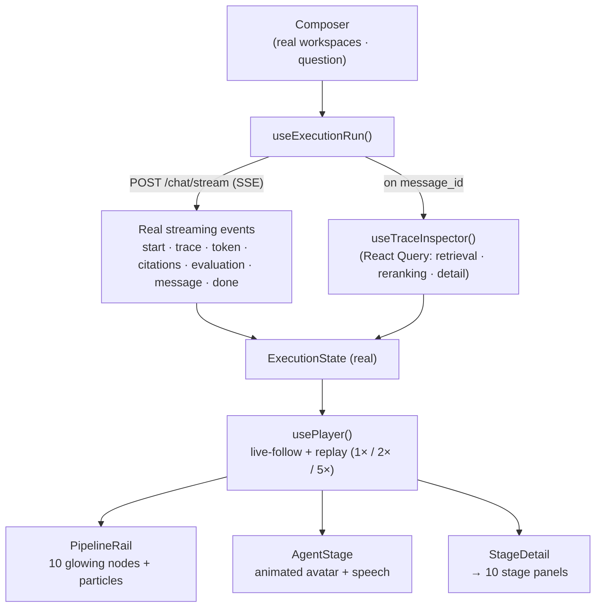

# File 10 — AI Execution Studio

> Route: `/ai-execution-studio` · Module: `frontend/features/ai-execution-studio/` · Dark-only, immersive.

## Purpose

The AI Execution Studio turns the entire RAG pipeline into a **real-time animated
experience**. It is deliberately *not* a dashboard: instead of charts, it lets a
viewer **watch the AI think** as a question travels through every stage of the
agentic pipeline. The design goal is that a jury member or recruiter understands
the whole RAG execution process within ~30 seconds.

It is driven by **real DevPilot AI APIs** — the same streaming endpoint that
powers the chat — not by mock data. Scores, tokens, ranks and evaluation values
are all real; only the spatial/particle layer is a *visualization* of that real
data.

## Architecture

**Module layout**

| File | Responsibility |
|---|---|
| `types.ts` | `ExecutionState` contract (the real captured run) |
| `constants.ts` | 10 stage definitions, cinematic palette, `projectPoint()` vector projection |
| `useExecutionRun.ts` | Runs a real streaming question; merges full trace data via React Query |
| `usePlayer.ts` | Timeline engine: follows live events, then replay/scrub with speed control |
| `components/PipelineRail.tsx` | Vertical glowing nodes + animated connectors + flowing particles |
| `components/StageDetail.tsx` | `AnimatePresence` crossfade into the active stage panel |
| `components/stages/*` | The 10 stage panels (one per pipeline stage) |
| `components/AgentAvatar.tsx` | Hand-built SVG character with per-stage moods |
| `components/AgentStage.tsx` | Avatar + typewritten speech bubble |
| `components/Composer.tsx` | Real workspace picker + question + run |
| `components/TransportBar.tsx` | Play / pause / replay + speed + stage scrubber |
| `components/Gauge.tsx` | Animated radial gauge |
| `app/ai-execution-studio/page.tsx` | Immersive dark page, auth-gated, **lazy-loads** the studio |

## Execution pipeline (the 10 stages)

Real streaming/trace events are mapped monotonically to ten visual stages:

1. **User Question** — the question enters the system.
2. **Query Embedding** — a 768-d vector forms (representational of the embedding step).
3. **Vector Search** — an SVG vector space; retrieved chunks plotted by **real similarity score**, nearest glow / far fade.
4. **Chunk Retrieval** — real chunks fly in with **real similarity bars**.
5. **Reranking** — live reorder showing **real original → final rank** deltas and rerank scores.
6. **Context Window** — chunks merge into one context (real counts).
7. **Prompt Builder** — system prompt + real retrieved context + real question → final prompt.
8. **LLM Generation** — **real token streaming** with a blinking caret (`aria-live`).
9. **Evaluation** — four animated gauges from the **real evaluation** (faithfulness, relevance, context precision, grounding).
10. **Trace Persistence** — message → agent runs → chunks → evaluation written, with real ids/counts.

## Workflow

1. The viewer selects a real workspace and types a question (or picks an example).
2. `useExecutionRun` opens the **real SSE stream**; as each `trace`/`token`/`citations`/`evaluation` event arrives, the pipeline advances and the matching node/panel animates.
3. On the `message` event, React Query hydrates the **full real trace** (retrieved chunks with `source_scores`, reranking `original→final` ranks, agent latencies).
4. When complete, `usePlayer` becomes a scrubber: **play / pause / replay** at **1× / 2× / 5×**, re-performing every stage from the captured real data.

## Visualization engine

- **Framer Motion 12** for all motion; **SVG** for the vector space, gauges and avatar; **SMIL/transform-only** animations to protect the 60fps budget.
- An **animated AI avatar** (`AgentAvatar`) with per-stage moods — thinking (eyes up), searching (eyes dart), reading (scan), writing (mouth "talks"), checking (squint), done (happy + sparkle burst), error (worried) — plus a **typewritten speech bubble** that narrates each stage in-character but professionally.
- Deterministic `projectPoint()` places each real chunk in 2-D vector space from its real id/score (never random).

## Innovation

- **Real-data-driven cinematic** — the animation is bound to live execution, not a scripted demo. This is the distinctive contribution versus a static architecture slide.
- **Dual mode** — live "watch it think" during a run, then deterministic replay/scrub for presentation.
- **Character-led explanation** — the avatar makes a technical pipeline legible and memorable.

## User & educational value

- **Engineers / operators**: a fast mental model of how a question becomes a grounded answer, and where latency or quality is spent.
- **Jury / recruiters**: a 30-second, self-explanatory tour of the whole platform.
- **Learners**: each stage is isolated and labeled, turning RAG from a black box into an inspectable process.

## Performance & accessibility

- The studio is **lazy-loaded** (`next/dynamic`, `ssr:false`) — the route ships light (~114 kB) and the Framer-Motion bundle is code-split.
- `MotionConfig reducedMotion="user"` respects `prefers-reduced-motion`; `aria-live` on the generation stream; keyboard-reachable controls; responsive at 1366 / 1600 / 1920 with no horizontal scroll.
- Graceful error handling: an expired session surfaces a clear "session expired" banner instead of crashing.
