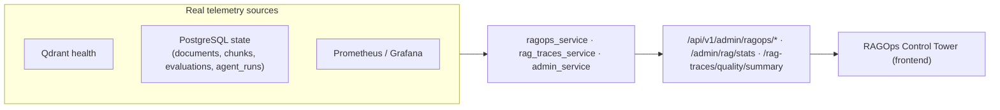

# File 11 — RAGOps

> Routes: `/admin/ragops` (Control Tower), `/admin/ragops/workspaces/[id]`, `/admin/ragops/documents/[id]`, `/admin/quality` · API: `/api/v1/admin/ragops/*`, `/api/v1/admin/rag/stats`, `/api/v1/admin/rag-traces/quality/summary`.

## Overview

RAGOps is DevPilot AI's **operational layer for the RAG pipeline** — the bridge
between architecture and observability. Where traditional dashboards report
business metrics, RAGOps reports the **health and quality of the AI system
itself**: is retrieval working, are embeddings covered, are answers faithful, are
documents being indexed, where are the failures. It is admin/super-admin gated.

## Capabilities

### 1. Health Monitoring
- **Qdrant health** (`GET /admin/ragops/qdrant/health`) — collection reachability and vector store status.
- **Ops health** (`GET /admin/ragops/ops-health`) and **vector health** (`GET /admin/ragops/vector-health`) — surface the live state of the data/AI tier.
- Service status indicators (Qdrant / Redis / Celery) feed the control tower header.

### 2. Embedding Coverage
- Per-workspace **embedding coverage %** = `chunks_with_vector_id / total_chunks` — exposes whether every chunk that should be searchable actually has a Qdrant vector.
- Surfaced as a real metric on each workspace card and aggregated platform-wide.

### 3. Retrieval Quality
- Retrieval strategy (hybrid: semantic + keyword), candidate count (15) and `rerank_top_k` (5) are configuration-visible.
- Context precision (from evaluations) reports how useful the retrieved context was.

### 4. Faithfulness
- Average **faithfulness** across answers (grounding in retrieved context), drawn from the `evaluations` table via `quality/summary`.
- Rendered as tokenized score meters; low faithfulness flags traces for review.

### 5. Hallucination Detection
- Average **hallucination score** plus a **hallucination-risk count** of answers above the risk threshold.
- The `CorrectorAgent` repairs unfaithful answers; corrected answers are counted separately.

### 6. Workspace Health
- A **per-workspace RAG health score (0–100)** combining indexed-document ratio, embedding coverage, faithfulness, low hallucination and reliability.
- The `WorkspaceHealthCenter` renders a paginated card grid (worst-health first) with coverage, docs indexed/total, chunks, faithfulness, hallucination and failed-document counts; each card links to the workspace detail page.

### 7. Agent Monitoring
- **Average latency by agent** (`agents.avg_latency_ms_by_agent` from admin stats) for the seven pipeline agents — router, query_rewriter, retrieval, reranker, generator, evaluator, corrector — rendered as horizontal latency bars.
- Token usage and estimated cost (`prompt_tokens`, `completion_tokens`, `total_tokens`, `estimated_cost_usd`) are surfaced from real admin stats.

### 8. Failure Center
- **Failed documents** are listed with their workspace and upload time; the ingestion pipeline can be **retried** (`POST /admin/ragops/documents/{id}/retry`).
- The document detail page (`/admin/ragops/documents/[id]`) shows the per-document pipeline state (`GET /documents/{id}/pipeline`).
- Backend resilience: `process_document_task` retries up to 3 times before a document is marked `failed`.

### 9. Observability
- Application metrics are exported to **Prometheus** (FastAPI multi-process) and visualized in **Grafana** (provisioned dashboards under `monitoring/`).
- RAGOps complements this with **AI-specific** observability that generic infra dashboards cannot provide: retrieval quality, faithfulness, embedding coverage and agent latency.

## Frontend surfaces

| Page | What it shows |
|---|---|
| `/admin` (Operations Overview) | Platform health ring, document pipeline, RAG quality meters, agent latency, LLM usage & cost, risky-action / risky-answer / failed-document watchlists |
| `/admin/quality` | Quality scorecard, faithfulness & hallucination distributions, answer outcomes, agent latency, worst-by-hallucination / worst-by-relevance |
| `/admin/ragops` | RAGOps Control Tower — service health, workspace health center, pipeline & failure center |
| `/admin/ragops/workspaces/[id]` | Per-workspace deep dive |
| `/admin/ragops/documents/[id]` | Per-document ingestion pipeline + retry |

All charts are **theme-aware, token-driven CSS/SVG** (lightweight, no Recharts on the redesigned pages) and respect the platform's no-mock-data discipline — genuinely missing values render honestly (e.g. "Not captured").
