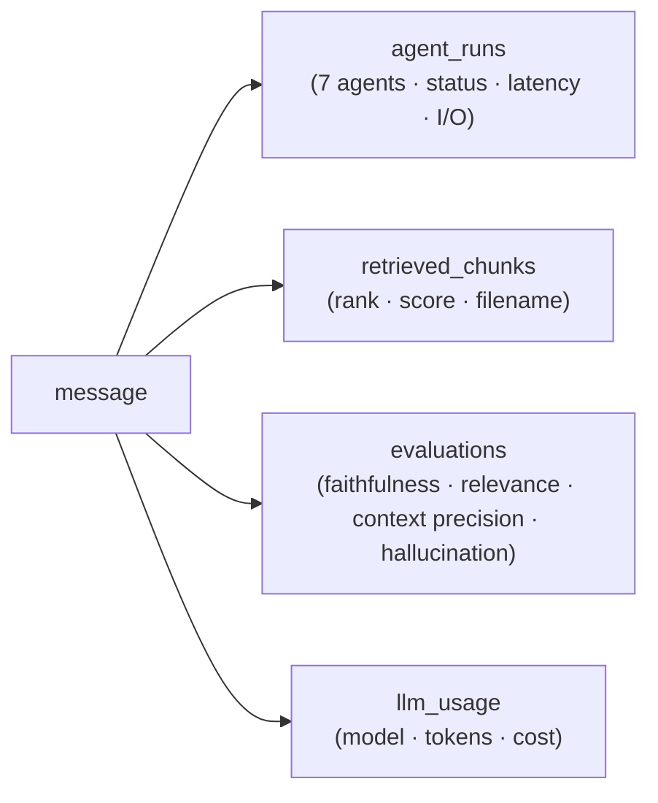

# File 12 — RAG Traces (Traceability)

> Routes: `/admin/rag-traces` (Observatory), `/admin/rag-traces/[messageId]` (AI Trace Inspector) · API: `/api/v1/admin/rag-traces/*`.

## Overview

Traceability is a first-class concept in DevPilot AI, not an afterthought. Every
RAG answer is **fully reconstructable** from persisted data, which makes the
platform **auditable** and **reproducible** — the key differentiator versus a
black-box assistant. The trace is modeled as a directed chain centered on the
assistant message.

## Trace lifecycle

1. **Creation** — when a user asks a question, the streaming endpoint runs the agentic workflow and, on completion, persists the message and its full lineage.
2. **Capture** — each of the seven agents writes an `agent_runs` row (status, latency, input/output preview, error); retrieved passages write `retrieved_chunks`; the evaluator writes one `evaluations` row; token accounting writes `llm_usage`.
3. **Persistence after completion** — database writes happen after the answer is assembled, so the stored trace reflects the final, corrected answer with its citations and scores.
4. **Inspection** — admins explore traces in the Observatory and drill into the Inspector.

## What a trace records

| Aspect | Source | Detail |
|---|---|---|
| **Message tracking** | `messages` | The user question and assistant answer, scoped to conversation + workspace + user |
| **Retrieved chunks** | `retrieved_chunks` | Rank, similarity score, filename, content preview, source sub-scores |
| **Citations** | answer + chunks | `[n]` markers in the answer linked to the source passages |
| **Evaluations** | `evaluations` | Faithfulness, relevance, context precision, hallucination score, explanation, evaluation method, corrected flag |
| **Agent runs** | `agent_runs` | One row per agent: status, latency, input/output preview, error |
| **LLM usage** | `llm_usage` | Model, prompt/completion/total tokens, cost (when captured) |

## RAG Trace Observatory (list) — `/admin/rag-traces`

The list page is a **LangSmith/Datadog-grade observatory**, not a plain table:

- **KPI strip** — total traces, average faithfulness/relevance/hallucination, corrected answers, no-context/ungrounded (global summary when unfiltered, filtered sample otherwise).
- **Filter bar** — workspace, user, faithfulness range, hallucination range, retrieval strategy, corrected, has-citations, date range, search (all server-supported via `GET /admin/rag-traces`).
- **Distributions** — faithfulness, hallucination and latency histograms + a worst-first workspace comparison (rendered only when there are enough traces to be meaningful).
- **Alerts** — "needs investigation" band: most hallucinated, recently corrected, slowest, worst faithfulness.
- **Interactive trace cards** — question, answer preview, workspace, user, retrieval strategy, faithfulness/relevance/hallucination, latency, citation count, corrected badge, and a **0–100 trace health score**; each links to the Inspector.

## AI Trace Inspector (detail) — `/admin/rag-traces/[messageId]`

A nine-section immersive reconstruction of a single query's full life cycle,
powered by `getRagTrace` + `getRagTraceRetrieval` + `getRagTraceReranking` +
`getRagTraceEvaluation` (React Query, four parallel real calls):

1. **Trace Summary** — SVG health ring, question/answer, workspace, user, latency, faithfulness, hallucination risk, corrected badge.
2. **Agent Timeline** — vertical rail over the seven agents with status/latency and expandable real input/output previews (un-run agents shown as *skipped*, never phantom-green).
3. **Retrieval Explorer** — ranked chunk cards with overall + semantic/keyword sub-score bars; cited vs retrieved.
4. **Reranking Explorer** — `#original → #final` with promoted/demoted arrows; honest fallback when reranker detail was not stored.
5. **Citation Explorer** — the answer with interactive inline `[n]` chips that bi-directionally highlight the matching source.
6. **Evaluation Center** — faithfulness/relevance/context-precision/hallucination + risk level + evaluator explanation.
7. **Corrector Analysis** — a word-level (LCS) diff of generated → final answer with a Diff/Split toggle + reason.
8. **LLM Usage** — generation time plus tokens/model/cost when present (honest "Not captured" otherwise).
9. **Interactive Trace Graph** — a pipeline diagram whose nodes scroll to each stage.

Plus a collapsed, **secret-sanitized** raw JSON debug block (never shown by default).

## Auditability

- Every administrative action is recorded in `audit_logs` (actor, action, target, reason, IP) and surfaced in `/admin/audit-logs`.
- Trace views **redact secrets** (keys containing password/secret/token/api_key) so observability never leaks credentials.
- Quality is summarized globally via `GET /admin/rag-traces/quality/summary` (averages, low-quality / hallucination-risk / no-context counts, worst-by-hallucination and worst-by-relevance).

## Reproducibility

Because the message, its agent runs, retrieved chunks and evaluation are all
persisted, any answer can be **reconstructed and explained after the fact**
without depending on transient logs — the foundation for debugging regressions,
justifying answers to stakeholders, and academic reproducibility of results.
