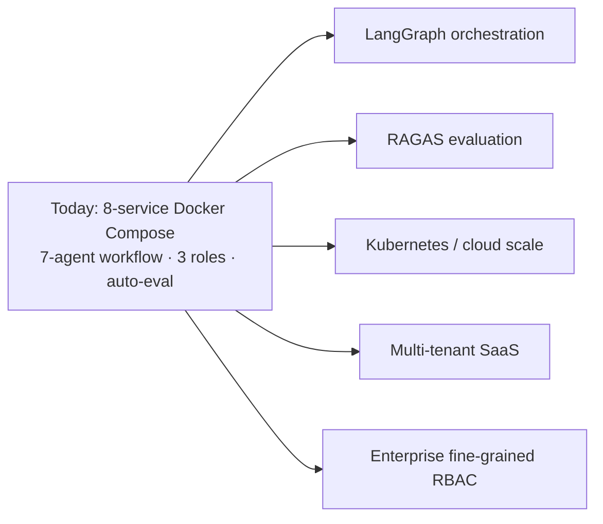

# 13 — Business Value

## 1. Problem Solved

Software engineering organizations sit on large bodies of institutional knowledge — architecture decisions, runbooks, API references, onboarding material, design docs — that are simultaneously **inaccessible at the moment of need** and **dangerous to delegate to a generic AI assistant**.

Two concrete problems define the gap DevPilot AI fills:

1. **Knowledge retrieval is slow and unreliable.** Engineers cannot find the right answer quickly; tribal knowledge bottlenecks on a few senior people; new hires ramp slowly.
2. **Generic assistants are unfit for internal knowledge.** Public chatbots do not know the organization's private systems, and even when they respond, the answer is opaque — no grounding in the organization's documents, no citation chain, no per-step trace, no quality signal. For engineering work, an unverifiable answer is an unusable answer.

DevPilot AI solves both: it grounds answers in the organization's **own** knowledge base and exposes **complete transparency** over the reasoning that produced each answer — the agent trace, the retrieved chunks, the citations, and an automatic evaluation score.

---

## 2. Target Users

| User | Need DevPilot AI serves |
|---|---|
| **Software engineers** | Fast, grounded answers about internal systems and procedures, with citations they can verify. |
| **New hires / onboarding engineers** | A queryable, traceable interface to ramp up on the codebase and conventions without constantly interrupting seniors. The Architecture Explorer doubles as an onboarding tool. |
| **Tech leads & architects** | A grounded interface over design and architecture decisions; the Architecture Explorer to navigate the system. |
| **Platform / DevOps engineers** | Operational visibility over the RAG system via the RAGOps Control Tower, Prometheus, and Grafana. |
| **Engineering managers / administrators** | Workspace, membership, and access control via RBAC (`user`, `admin`, `super_admin`). |

The platform is organized around **multi-workspace** isolation, so different teams or domains maintain separate knowledge bases, members, and conversations.

---

## 3. Current Limitations (Honest Assessment)

A truthful value assessment names the boundaries of the current system:

- **Single-host deployment.** The platform is orchestrated with Docker Compose across eight services on a single host. It is not yet deployed on a horizontally scaling orchestrator (Kubernetes), so production scale-out is future work.
- **Not yet multi-tenant SaaS.** The current model is multi-**workspace** within a deployment, not a hardened multi-**tenant** SaaS offering with tenant-level isolation guarantees.
- **Coarse-grained access control.** RBAC currently distinguishes three roles (`user`, `admin`, `super_admin`); fine-grained enterprise RBAC (granular per-resource permissions) is future work.
- **Hosted generation dependency.** While document **embeddings** are computed locally via Ollama (preserving privacy at index time), the **generation** step calls the hosted Gemini API. Fully air-gapped generation is not the current configuration.
- **Bounded generation parameters.** Answers are generated with a max of 1000 output tokens and temperature 0.2 — tuned for concise, grounded responses, which by design constrains very long-form output.
- **Evaluation is automatic, not human-calibrated at scale.** The evaluator agent provides an automatic quality signal; a formal, standardized RAG evaluation framework (e.g., RAGAS) is on the roadmap rather than in place today.

Stating these limitations is itself part of the value proposition: DevPilot AI's culture is transparency, and that extends to its own maturity.

---

## 4. Competitive Advantages

DevPilot AI's position is defined by the combination of **private grounding** and **complete transparency** — a combination no single competitor in the adjacent categories offers.

| Capability | ChatGPT | Notion AI | LangSmith | Datadog | Internal search | **DevPilot AI** |
|---|---|---|---|---|---|---|
| Answers grounded in your **own** documents | No | Partial (Notion content) | No | No | Keyword only | **Yes (Agentic RAG)** |
| Self-hostable / data stays private | No | No | No | No | Varies | **Yes (self-hostable stores + local embeddings)** |
| Per-answer reasoning trace (agent-by-agent) | No | No | Yes (LLM tracing) | No | No | **Yes (Trace Observatory + 9-section Inspector)** |
| Automatic answer evaluation | No | No | Partial (eval tooling) | No | No | **Yes (evaluator agent → evaluations)** |
| RAG-specific operational observability | No | No | Partial | Generic infra metrics | No | **Yes (RAGOps Control Tower + Prometheus/Grafana)** |
| Live, visual reasoning experience | No | No | No | No | No | **Yes (AI Execution Studio, 10-stage SSE-driven)** |
| Navigable architecture map | No | No | No | Service maps (infra) | No | **Yes (Architecture Explorer, React Flow)** |
| Multi-workspace + RBAC | No | Team spaces | Project-based | Org/teams | Varies | **Yes (workspaces + 3 roles)** |
| Real token streaming over SSE | Yes | Partial | N/A | N/A | No | **Yes (Gemini SSE → frontend ReadableStream)** |

**How DevPilot AI differs from each category:**

- **vs. ChatGPT** — ChatGPT answers from a public corpus with no grounding in your knowledge and no reasoning transparency. DevPilot AI answers from your private documents and exposes the entire pipeline.
- **vs. Notion AI** — Notion AI is grounded in Notion content within a productivity suite; it offers no agent trace, no automatic evaluation, and no RAG operations surface. DevPilot AI is a purpose-built, observable RAG platform.
- **vs. LangSmith** — LangSmith is a developer-facing **tracing/evaluation tool** for LLM apps; it is not itself an end-user, multi-workspace knowledge product. DevPilot AI **embeds** tracing and evaluation as built-in product features for both end users and operators.
- **vs. Datadog** — Datadog observes **infrastructure**; it has no concept of RAG reasoning, retrieved chunks, or answer quality. DevPilot AI's RAGOps observes the **AI reasoning layer** specifically.
- **vs. internal search** — Keyword/internal search returns documents, not grounded, evaluated, cited answers, and provides no reasoning transparency. DevPilot AI returns synthesized, grounded answers with full traceability.

The defensible differentiator is the **intersection**: private grounding **and** complete transparency **and** RAG operations **and** flagship visualization, in one platform.

---

## 5. Future Evolution

The roadmap extends the platform from a single-host, multi-workspace system toward an enterprise-grade, scalable SaaS:

- **LangGraph** — evolve the seven-agent `AgenticRAGWorkflow` onto a formal graph-orchestration framework for more sophisticated, branchable, and resumable agent flows.
- **RAGAS** — adopt a standardized RAG evaluation framework to complement the current automatic evaluator agent with rigorous, benchmarkable answer-quality metrics.
- **Cloud / Kubernetes** — graduate from single-host Docker Compose to a horizontally scalable Kubernetes deployment for production scale and resilience.
- **Multi-tenant SaaS** — extend multi-workspace into hardened multi-tenant isolation, enabling DevPilot AI to be offered as a SaaS product.
- **Enterprise RBAC** — move beyond the three current roles to fine-grained, per-resource role-based access control suited to large organizations.

---

## 6. Industrial Impact

For an engineering organization, DevPilot AI delivers impact along several axes:

- **Faster knowledge access.** Engineers get grounded answers with citations instead of hunting through scattered documents, reducing time-to-answer.
- **Faster onboarding.** New hires use the platform — and the Architecture Explorer's navigable system map — to ramp up without constantly drawing on senior engineers' time.
- **Trustworthy AI in production.** Because every answer carries a trace, citations, and an evaluation score, the organization can adopt AI assistance for internal knowledge **without** the trust deficit that blocks generic assistants.
- **Operable AI.** RAGOps brings the metrics-and-dashboards operations culture (Prometheus/Grafana) to the AI layer, so the system can be run reliably rather than treated as an unmonitorable black box.
- **Data sovereignty.** Self-hostable stores and local embedding generation keep proprietary knowledge under the organization's control — a hard requirement in many enterprise and regulated settings.

In short, DevPilot AI demonstrates how RAG can be moved from a demo into a **production, observable, trustworthy** capability inside a software organization.

---

## 7. Academic Contribution

As an academic/engineering project, DevPilot AI contributes a complete, end-to-end reference implementation of **production-grade Agentic RAG with first-class observability and traceability** — an area where most published examples stop at a prototype chat loop. Specific contributions:

- **An agentic RAG architecture** realized as a seven-agent workflow (router → query_rewriter → retrieval → reranker → generator → evaluator → corrector) with each step persisted and inspectable.
- **A concrete traceability model** — the relational chain `message → agent_runs → retrieved_chunks → evaluations` (within an 11-table schema) that makes AI reasoning auditable.
- **The RAGOps concept** — applying the metrics/observability discipline of modern software operations to the RAG pipeline, with a working Prometheus/Grafana backbone and a control-tower product surface.
- **Novel transparency visualizations** — the AI Execution Studio (a ten-stage pipeline animated by real SSE events) and the Architecture Explorer (an interactive, live-flow architecture map) as approaches to making AI systems explainable and explorable.
- **A full, layered engineering blueprint** — delivered across 23 phases from Docker foundation through async ingestion, hybrid retrieval, reranking, the agentic workflow, design system, real streaming, and the flagship visualizations — usable as a teaching and reference artifact for building real RAG systems.

The unifying academic thesis the project supports: **transparency and operability are necessary, not optional, properties of trustworthy RAG systems**, and they can be engineered end to end.

---

## 8. Summary

DevPilot AI's business value rests on solving the twin failures of generic AI assistants for engineering teams — lack of private grounding and lack of transparency — through an honest, production-grade Agentic RAG platform. Its competitive position is the unique intersection of private grounding, complete traceability, automatic evaluation, RAG-specific observability, and flagship visualization. With a clear roadmap (LangGraph, RAGAS, Kubernetes, multi-tenant SaaS, enterprise RBAC), the platform points toward an enterprise-grade future while already delivering industrial impact and a substantive academic contribution today.
